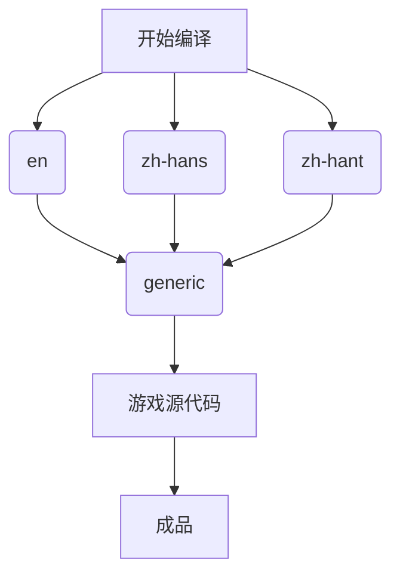

![ 请使用 GitLab 生成此流程图。 ]

```mermaid
	graph TD;
		A[开始编译];
		A --> B1(en);
		A --> B2(zh-hans);
		A --> B3(zh-hant);
		B1 --> C(generic);
		B2 --> C;
		B3 --> C;
		C --> D[游戏源代码];
		D --> E[成品];
```
